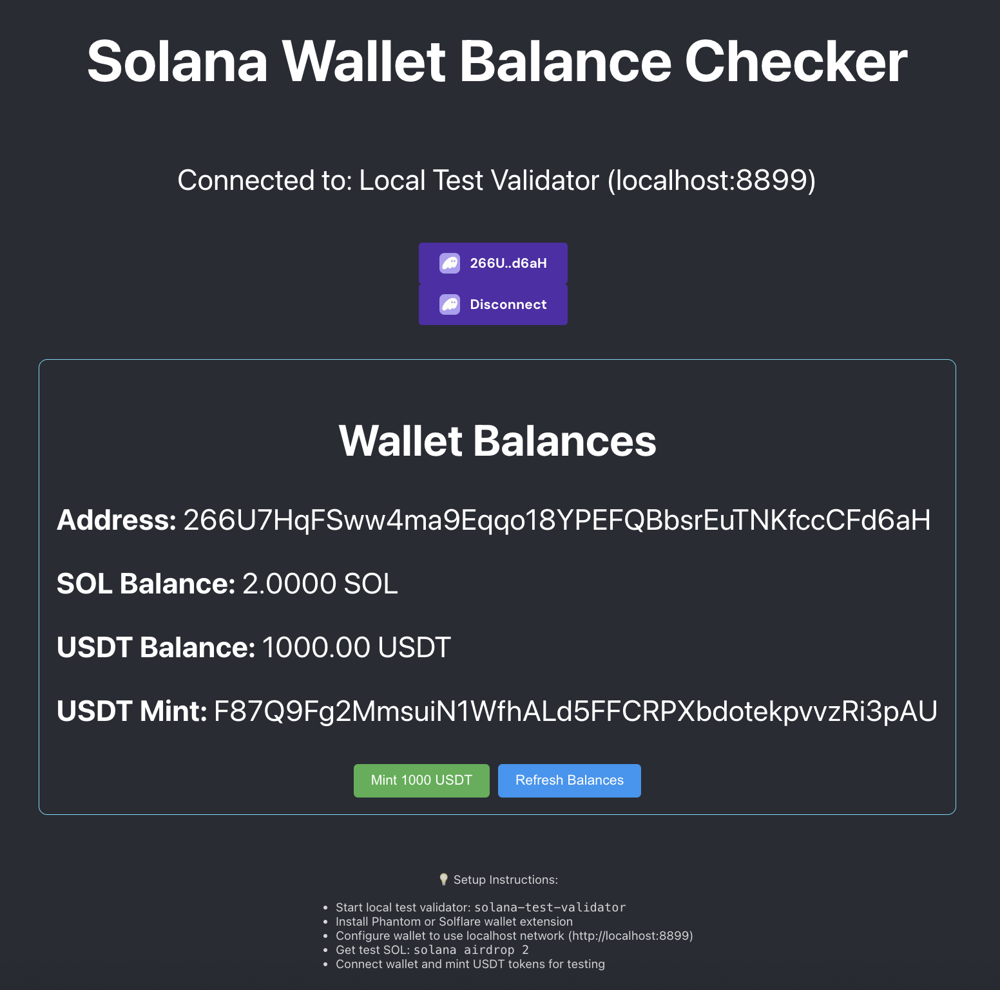

# solana-wallet-app
Solana Wallet Balance Checker & USDT Minter

## Installations
```bash
curl --proto '=https' --tlsv1.2 -sSf https://sh.rustup.rs | sh
curl --proto '=https' --tlsv1.2 -sSfL https://solana-install.solana.workers.dev | bash
npm install -g yarn
```
Install phantom wallet to connect to solana.

## Setup
```bash
# Start solana local network
solana-test-validator
```

## Run Wallet App
```bash
yarn install
npm start
```

Open [http://localhost:3000](http://localhost:3000) to view it in your browser.


